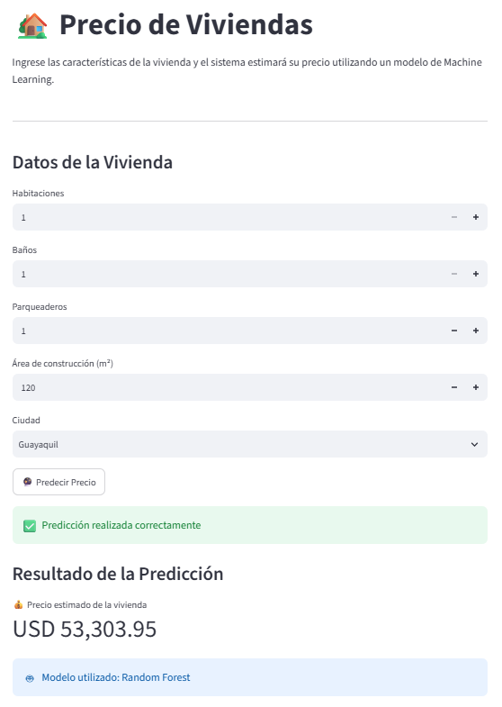
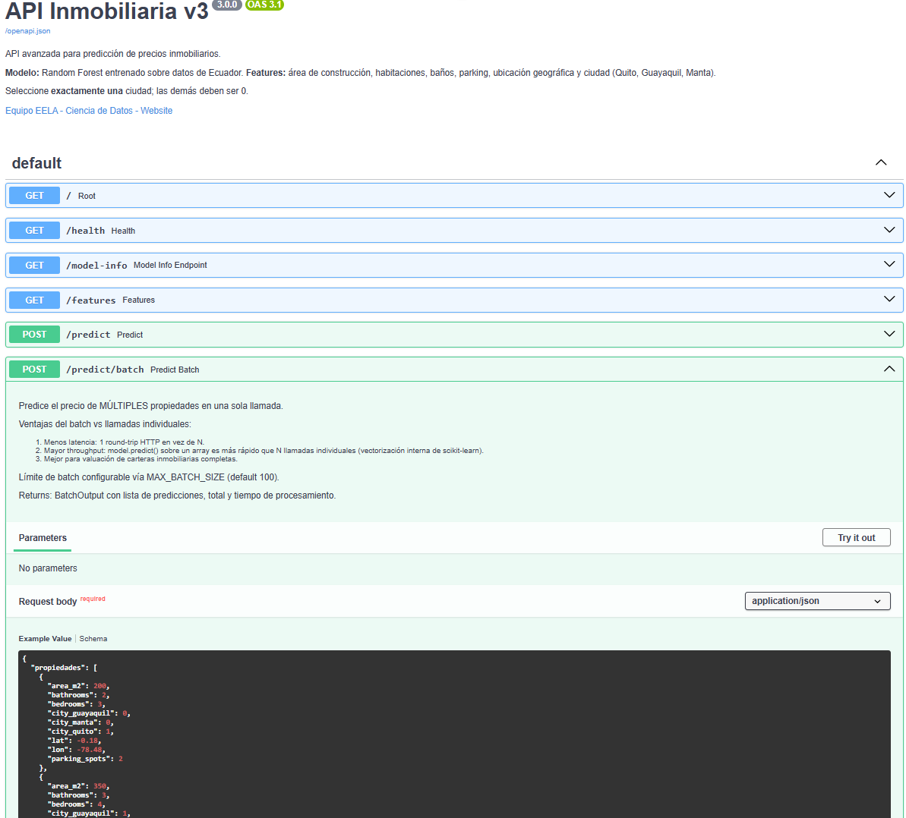

#  Sistema Inteligente de Predicción de Precios de Viviendas


---

#  Descripción

Este proyecto corresponde al **Proyecto Final del Diplomado de Python Fullstack**.

Su objetivo es predecir el precio de una vivienda con el modelo de **Machine Learning**, donde se integran todos los elementos aprendidos en el trayecto del curso:

- Web Scraping
- Procesamiento de datos
- Modelo de Machine Learning
- API REST con FastAPI
- Interfaz Web con Streamlit
- Control de versiones mediante Git y GitHub

La aplicación permite que el usuario ingrese la información de una vivienda y obtenga una predicción del precio en tiempo real.

---

#  Autora

**Kathy Tatiana Vallejo Villa**

Proyecto Final

Diplomado Python Fullstack

---

#  Repositorio GitHub

https://github.com/Kathy-Tatiana/Proyecto-Diplomado-Python

---

#  Arquitectura del Proyecto

```text
                    Web Scraping
                          │
                          ▼
                 Dataset (CSV)
                          │
                          ▼
               Entrenamiento del Modelo
                          │
                          ▼
                  Modelo Random Forest
                          │
                          ▼
                     FastAPI (API)
                          │
                          ▼
                 Streamlit (Frontend)
                          │
                          ▼
                Predicción del Precio
```

---

#  Tecnologías utilizadas

- Python
- FastAPI
- Streamlit
- Scikit-learn
- Pandas
- Requests
- Joblib
- Uvicorn
- Git
- GitHub

---

#  Estructura del Proyecto

```text
Proyecto_Diplomado/

│
├── casas/
│   ├── api_v3_avanzada.py
│   ├── modelo_inmobiliario.pkl
│   ├── plusvalia_procesado.csv
│   ├── DOCUMENTACION.md
│   ├── ejercicio_eela.py
│   ├── instrucciones.txt
│   └── requirements.txt
│
├── streamlit_app.py
├── scrapper.py
├── requirements.txt
├── README.md
└── .gitignore
```

---

#  Instalación

## Clonar el repositorio

```bash
git clone https://github.com/Kathy-Tatiana/Proyecto-Diplomado-Python.git
```

Ingresar al proyecto

```bash
cd Proyecto-Diplomado-Python
```

---

## Crear entorno virtual

Windows

```bash
python -m venv venv
```

Activar

```bash
venv\Scripts\activate
```

---

## Instalar dependencias

```bash
pip install -r requirements.txt
```

---

#  Ejecución

## Iniciar FastAPI

Ubicarse dentro de la carpeta **casas**

```bash
cd casas
```

Ejecutar

```bash
uvicorn api_v3_avanzada:app --reload
```

La API estará disponible en

```
http://127.0.0.1:8000
```

Documentación Swagger

```
http://127.0.0.1:8000/docs
```

---

## Ejecutar Streamlit

Desde la carpeta principal

```bash
streamlit run streamlit_app.py
```

---

#  Modelo de Machine Learning

Algoritmo utilizado

**Random Forest Regressor**

Variables utilizadas

- Área de construcción
- Habitaciones
- Baños
- Parqueaderos
- Ciudad
- Latitud
- Longitud

Variable objetivo

- Precio de la vivienda (USD)

---

#  API REST

## Endpoint

```
POST /predict
```

### Ejemplo de entrada

```json
{
    "area_m2": 200,
    "bathrooms": 2,
    "bedrooms": 3,
    "city_guayaquil": 0,
    "city_manta": 0,
    "city_quito": 1,
    "lat": -0.18,
    "lon": -78.48,
    "parking_spots": 2
}
```

### Respuesta

```json
{
    "precio_usd": 193165.03,
    "modelo": "Random Forest"
}
```

---

#  Flujo de Funcionamiento

1. El usuario ingresa la información de la vivienda.
2. Streamlit captura los datos.
3. Streamlit envía una solicitud HTTP a FastAPI.
4. FastAPI valida la información recibida.
5. Se carga el modelo entrenado (`modelo_inmobiliario.pkl`).
6. El modelo realiza la predicción.
7. FastAPI devuelve el resultado.
8. Streamlit presenta el precio estimado al usuario.

---

#  Limitaciones

- El modelo fue entrenado utilizando el conjunto de datos disponible para este proyecto.
- Las predicciones corresponden únicamente a las ciudades utilizadas durante el entrenamiento.
- El resultado constituye una estimación basada en el modelo y no reemplaza un avalúo profesional.

---

#  Conclusiones

Este proyecto integra las principales herramientas desarrolladas durante el Diplomado de Python Fullstack, demostrando la construcción de una solución completa que combina extracción de datos, procesamiento, Machine Learning, desarrollo de APIs e interfaces web.

---

#  Agradecimientos

A todos los maestros que nos orientaron y enseñaron estas herramientas que serán de muchísima utilidad en mi campo laboral **Gracias mil**.

#  Vista previa de la aplicación

## Aplicación desarrollada con Streamlit



---

## Documentación de la API (Swagger)

